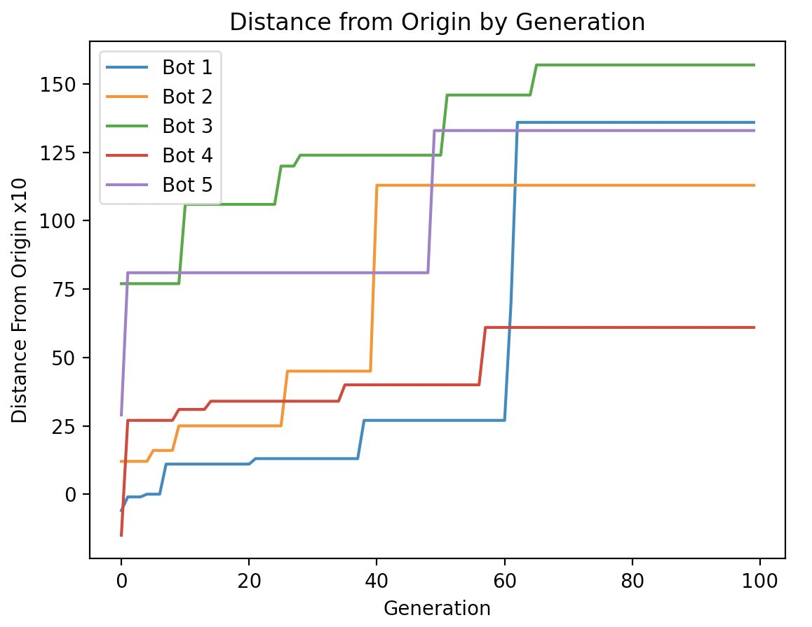

# mybots

The Project in this repository expands upon the guidance found in the ludobots reddit course (https://www.reddit.com/r/ludobots/wiki/installation/). This also utilizes pyrosim (Python Robot Simulation). This specific version uses bodies, sensors, motors, and synapses to design random bodies in a 3D space. The code builds off of a previous assignemtn to build a snake and literally branches off from this body to construct a random creature in the morphospace. As the body branches off it is optimized to move as far away from the origin as possible.

# Installation

Clone the following repository:

git clone -b assign7 https://github.com/michaeld74/mybots.git 

# Usage

Navigate to the mybots folder and run:

python3 search.py

# Evolution

The body is created from a head and expands in the positive y direction extending it's body. This specific iteration is designed to create boxes with joints at their corners that alternate between touching the ground and being suspended. From here, random limbs branch off to make the body fill the 3D space. The entire evolution process then checks how far this body can branch off to follow in it's directions which are to move far from the origin in the positive y direction. 

# Visual Example

![Click the link () to view videos of the robot in action]

This video shows the bot not being trained vs 2 iterations of a more trained robot with a different morphology moving away 

