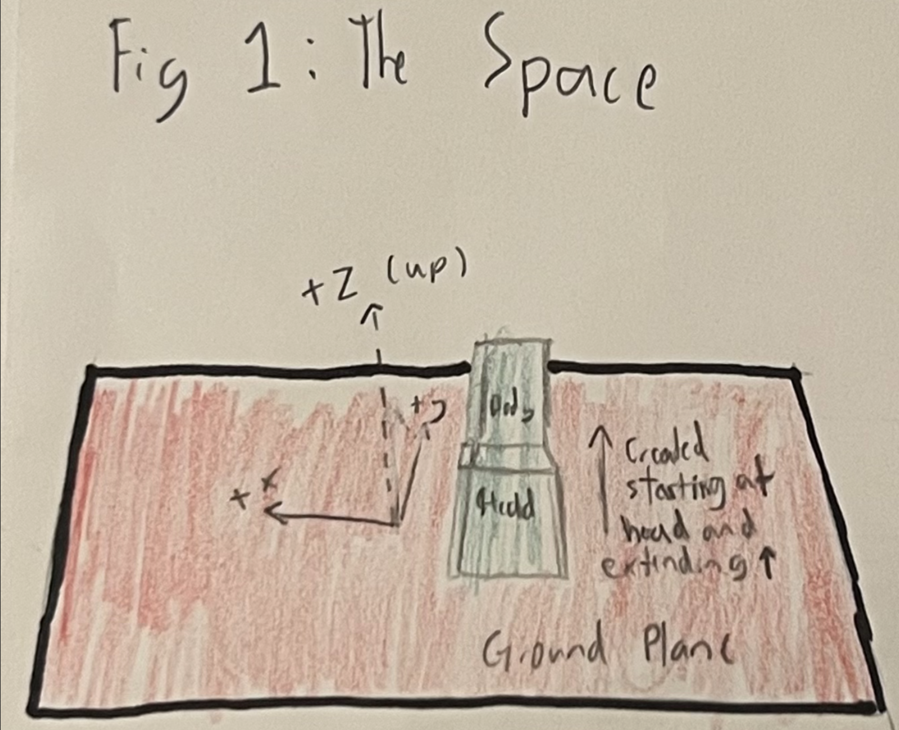
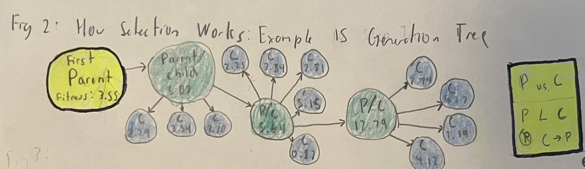
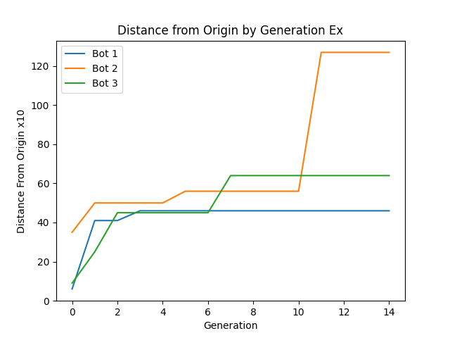
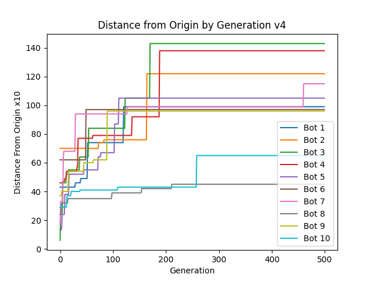

# mybots


The Project in this repository expands upon the guidance found in the ludobots reddit course (https://www.reddit.com/r/ludobots/wiki/installation/). This also utilizes pyrosim (Python Robot Simulation) to produce the simulations. This specific version uses bodies, sensors, motors, and synapses to design random bodies in a 3D space. The code builds off of a previous assignment to build a snake and literally branches off from this body to construct a random creature in the morphospace. As the body branches off it is optimized to move as far away from the origin as possible. What I felt made my project unique was instead of branching off the original snake, I revamped the build to add segments of the body two cubes at a time in the stair formation with added limbs branching off in other directions to identify how it would try to move in an optimal way. 

# Requirements

-Python 3.7/3.8

-Linux, macOS, or Windows with Visual Studios 2017

-numpy

-Matplotlib

-pyrosim

-pybullet

# Installation

Clone the following repository:

```
git clone -b assign7 https://github.com/michaeld74/mybots.git 
```

# Usage

In your terminal navigate to the mybots folder and run:

```
python3 search.py
```

After running search you can print out a graph to display the results by running:

```
python3 plotFitnessValues.py
```

To make adjustments and personalize your interactions with the code you can direct your way to constants.py. Here you can first off adjust both the population size of your sample as well as the number of generations run. You can also adjust the "loop" value which will determine how long your simulation runs for. 

# Evolution

The body is created from a head and expands in the positive y direction extending it's body. This specific iteration is designed to create boxes with joints at their corners that alternate between touching the ground and being suspended. From here, random limbs branch off to make the body fill the 3D space. The entire evolution process then checks how far this body can branch off to follow in it's directions which are to move far from the origin in the positive y direction. 

# Diagrams

<!--  -->


Figure 1 displays a diagram showing the creature in its "world". There is a plane that holds the creature above ground and the creation of this robot/creature extends into the positive y direction with the head starting near the origin.


<!--  -->


<!--  -->


Figure 2 displays an example for how the selection process goes between parent and child following the parallel hill climber process. In this specific example we look at a simulation with a population of 3 and 15 generations. The graph depicts these 3 robots. Figure 2 demonstrates the evolution of the most optimal one. As seen in the far right of figure 2, there is a decision between parent child to see "who should go on". The robot with the better fitness value becomes the parent for the next interation and this comparison continues for all 15 generations. As seen in both the graph and the diagram, there is a change of parent every time there is an increase in the y on the graph and a move to a new green circl in the diagram.


# Observations

I think one of the more interesting observations of this specific robot is to move far from the origin it often shifts into a claw like position or something that is simlar to the Nike logo upside down. The results varried from jumping to tumbling to actually having small movements.

# Visuals

Click the link (https://www.youtube.com/watch?v=ICVO31igZIE) to the 2 min mini-movie of the robot in action


Teaser Video Link (https://www.youtube.com/watch?v=nQfZdfGeR4M)


Example of one of the 10 simulations run. Population Size:10, Generations:500, Distance From Origin: Units*10:



All Graphs can be seen in the main repository folder labeled V1 through V10.

# Citations

-K. Sims, "Evolving 3D Morphology and Behavior by Competition," in Artificial Life, vol. 1, no. 4, pp. 353-372, July 1994, doi: 10.1162/artl.1994.1.4.353.

-https://www.reddit.com/r/ludobots/wiki/installation/ (ludobots reddit)

- https://ccappelle.github.io/pyrosim/ (pyrosim)

